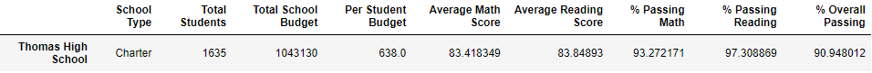
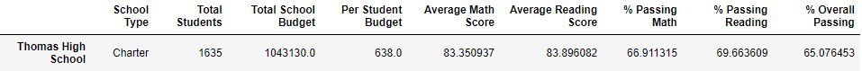
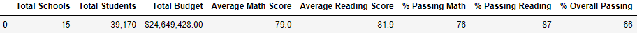
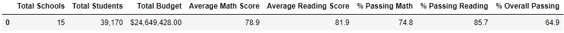

# School_district_Analysis
## Overview
A school district analysis needed to be conducted to determine the performance of students from 15 schools in the areas of math and reading. After the initial analysis was complete is was then discovered that there academic dishonesty was a factor in the scores of the students in ninth grade at Thomas High School. We were asked to remove the scores for math and reading for those students and complete a second analysis. 

## Results

### Thomas High School with 9th grade included

### Thomas High School with 9th grade excluded

Removing the 9th grade scores from the school's data caused noticable changes on the school level. As shown above there was no change in the number of students, the schools budget and the budget per student since no students were removed. Interestingly, the removal of the scores did not significantly impact the average reading and math scores since they remained around 83% for both math and reading. 

The following metrics were heavily impacted for Thomas High School without the 9th grade scores. 
  * Percentage passing math went from 93% to 66%
  * Percentage passing reading went from 97% to 69%
  * Overall passing percentage went from 90% to 65%

## Summary

### District summary with Thomas High 9th grade results included

### District summary with Thomas High 9th grade results excluded

The dataframes above show that there were no changes to the number of schools, total students and the budget. However, there was a slight drop in the pecentage of students passing math, reading and overall passing. Considering that the number of Thomas High students is a small portion of the total district student population, removing their 9th grade scores did not cause a significant change on the district results. 
